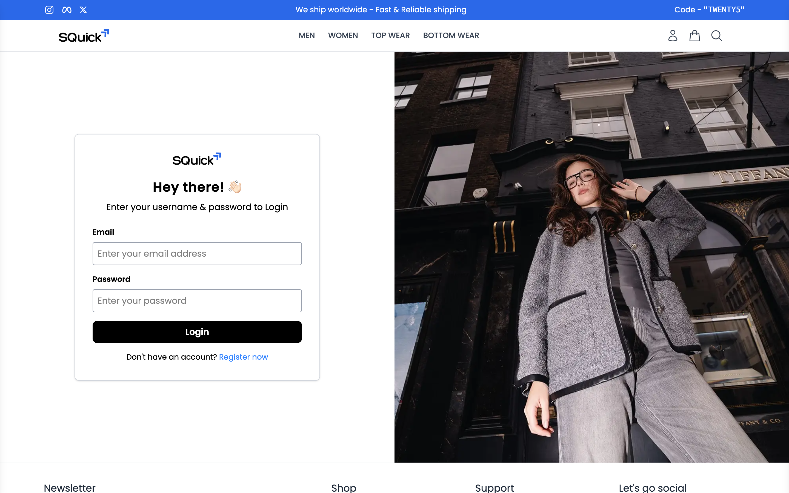
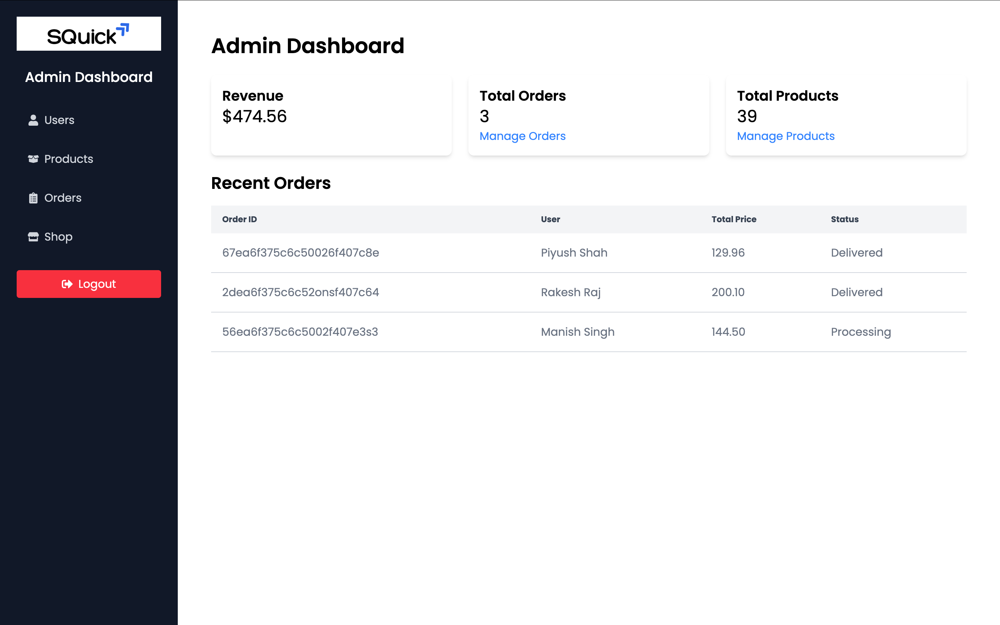
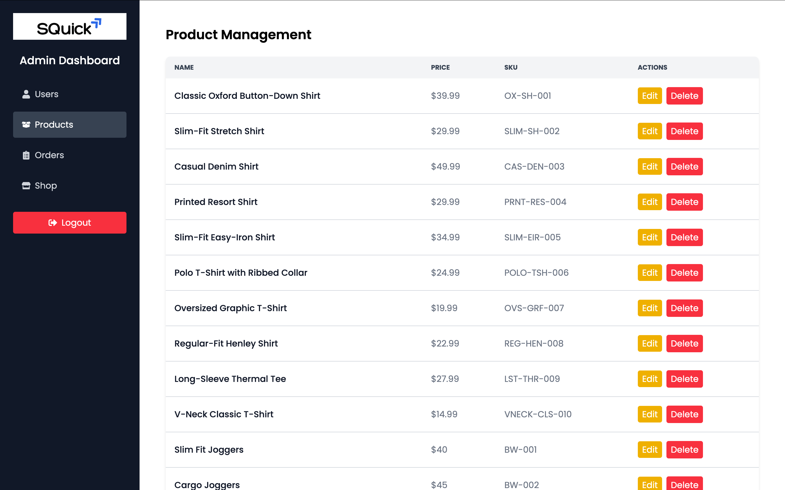

# ShopQuick - Full Stack E-Commerce Application.

ShopQuick is a fully functional **eCommerce application** built using the **MERN (MongoDB, Express.js, React.js, Node.js) stack**. It provides a seamless shopping experience with features such as product management, user authentication, order processing, and **PayPal payment integration**.  

[Live App](https://shopquick.onrender.com/)


## Table of Contents

- [Project Overview](#project-overview)
- [Features](#features)
- [Technologies](#technologies)
- [Schema Diagram](#schema-diagram)
- [Getting Started](#getting-started)
- [Usage](#usage)
- [License](#license)

## Project Overview

The project is a social networking platform built using the MERN (MongoDB, Express.js, React.js, Node.js) stack. It incorporates two major features: an automated content moderation system and context-based authentication. These features are accompanied by common functionalities found in social media applications, such as profile creation, post creation and sharing, liking and commenting on posts, and following/unfollowing users.

## **Key Features**  

### **User Authentication & Profile Management**  
- ✅ Secure **JWT-based authentication**  
- ✅ User **registration, login, and profile management**  
- ✅ Admin dashboard for managing users and products  

### **Product Management**  
- ✅ **Product listing with search & filtering**  
- ✅ Product details with images, descriptions, and pricing  
- ✅ Product reviews and ratings system  

### **Shopping Cart & Order Processing**  
- ✅ Add/remove items from the shopping cart  
- ✅ Checkout process with shipping and payment selection  
- ✅ **PayPal payment gateway integration**  
- ✅ Order history and tracking  

### **Admin Features**  
- ✅ Manage users, products, and orders  
- ✅ Add/edit/delete products  
- ✅ View and process orders  

### **Additional Functionalities**  
- ✅ Responsive UI for a smooth shopping experience  
- ✅ Email notifications for order updates  
- ✅ Secure password hashing and role-based access  

## **Technologies Used**  

- **Frontend:** React.js, Redux, Tailwind CSS  
- **Backend:** Node.js, Express.js, MongoDB  
- **Authentication:** JWT, 
- **Payment Integration:** PayPal API  
- **Other Tools:** Cloudinary  

## Getting Started

### Prerequisites

Before running the application, make sure you have the following installed:

- Node.js
- MongoDB or MongoDB Atlas account
- Paypal Developer's Account
- Cloudinary Account

### Installation

1. Clone the repository

```bash
git clone https://github.com/piyushshah69/shopquick-ecommerce-full-stack.git
```
2. Go to the project directory and install dependencies for both the client and server

```bash
cd client
npm install
```

```bash
cd server
npm install
```

3. Create a `.env` file in both the `client` and `server` directories and add the environment variables.

4. Start the server

```bash
cd server
node server.js
```

5. Start the client

```bash
cd client
npm run dev
```

### Configuration

Run the `npm run seed` script from the server directory. This script is used for seeding initial data(Products & Admin data) in the database.
```
cd server
npm run seed
``` 

#### `.env` Variables

In client paypal client and server url variables required:

```
VITE_PAYPAL_CLIENT_ID=
VITE_SERVER_URL=
```

In server variables port, mongo uri, jwt secret & cloudinary api name, key & secret are required:

```
PORT=<3000>
MONGO_URI=
JWT_SECRET=
CLOUDINARY_CLOUD_NAME=
CLOUDINARY_API_KEY=
CLOUDINARY_API_SECRET=
```





Thank you!